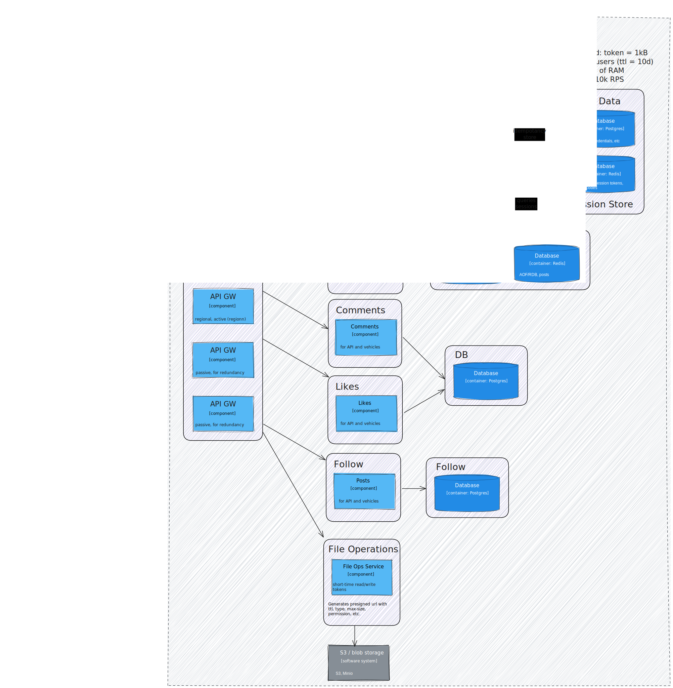

# Project instant

Very simplified instagram clone


## Team

**Kainazarov Zhassulan**

**Kakarov Damir**

**Akhmetov Olzhas**

**Kordabay Nursat**


## Getting Started

Make sure that .env is configured, and after that run:
``` bash
docker compose up
```

Architecture:


> Alternatively you can look at `architecture.excalidraw` file

### Description (Handwritten, from keyboard):

Well, there are plenty of microservices, all joint by single API Gateway (except email service).
Also there is no rate limiter on auth.

API gateway handles all requests, and reroutes to thair services based on URL. We used HashiCorp Consul as an API GW with service discovery. Services authorize themselves in API GW by token. This behaviour is called service discovery. In clustered environment addresses of services change very often. With service discovery there is no need to add address of new service instance to GW and reload every time new service is added or faulty service has restarted.

Also API gateway partially responsible for auth. Every time new request comes it extracts session id from Authorization header, by that session id it queries Redis DB to get user id. After that if session is valid it injects user id into X-User-ID header, so that other services behind gateway could get user id.

Another function of API GW if adding trace id to (request id in logs). It helps with debugging and centralized logging.

Auth service authenticates and authorizes user. We used Session based auth over JWT because: 
1. Just because
2. Sessions can be revoked easily, but JWTs only expire. JWTs need strategies like blacklisting, short-living tokens and etc to be revoked. Yes sessions need centralized store, and every request need to be passed through single auth point, but the session store is in memory and requests anyway would pass through API GW. So, we accepted this solution.

Also we do not store passwords. Passwords are previous century legacy. Instead we use one time passwords that are sent to email. Users will use codes from emails to authenticate. 
Users cannot forget password or mistakenly use simple passwords if there are NO PASSWORDS.

Also to prevent vulnerabilities like IDOR (insecure direct object reference, I know it from SSSD (AppSec) class) we use UUIDs for user id, instead of incremental number (serial).

Email are sent from third party SMTP server (gmail). Gmail has too long response time. So we used kafka to store email events. Auth service writes data into kafka. We deployed kafka on RKE2 k8s cluster. Then separate email service (as consumer) reads from kafka and makes requests to gmail.

File operations service. We could simply stream large files through one of our microservices. But this would add additional IO load. Backend is not the best place to serve files. So decided to make separate service to upload and download files to storage. None of the services interact with files. Only storage (S3, Minio) interacts with files. Then what does File operations service do? It generates presigned URLs to download, upload. User gets own short-living presigned URL with needed restrictions and upload or download specific file.


All other servies are mostly CRUDs. But thre is short info about all of them:

1. Posts service - genrates posts, with photos and text.

2. Comments service - users can leave comments on posts

3. Likes service - users can like posts.

4. Follow service - users can follow other users.


### Demo of working kafka cluster:

<video height="360" controls>
  <source src="./instant_email_demo.mp4" type="video/mp4">
</video>


### API Documentation, Swagger:
To get swagger documentation firstly run:
```bash
make swagger
```

Then open: http://localhost:8080/swagger/index.html


> Alternatively you can use Postman collection: `instant.postman_collection.json`


### Answers to questions:

#### Как выбор структуры базы данных (SQL или NoSQL) влияет на дизайн CRUD API? 


#### Какие проблемы могут возникнуть при массовых обновлениях данных через API? 


#### Почему важно использовать правильные HTTP-методы (GET, POST, PUT, DELETE), а не только POST? 


#### Какие уязвимости могут возникнуть при хранении JWT на клиентской стороне? 

Токен могут украсть если его хранить в localstorage. Его нужно хранить в Cookies с правильными настройками:

```
Set-Cookie: token="token"; HttpOnly; Secure; SameSite=Strict; Max-Age=3600; 
```


#### В каких случаях стоит ограничивать время жизни JWT, и какие проблемы это создаёт для UX?

Если приложение имеет высокие требования безпасности, данные очень чувствительные. Может замедлить загрузку станицы при запрашивании нового токена через Refresh Token, может потерятся не сохраненная работа.


#### Как логирование помогает в расследовании инцидентов безопасности? 

Помогает восстанавливать порядок событий, IP адреса, User-Agent и другие данные атакующих, помогает оценить масштаб атаки.


#### В чём разница между горизонтальным и вертикальным масштабированием, и как это связано с кэшированием? 


#### Какой риск несут фоновые задачи при сбое очереди сообщений? 


#### Почему важно учитывать идемпотентность задач при их повторном выполнении? 


#### Что сложнее поддерживать в большой системе: код или документацию? Почему? 

В больших системах обычно сложнее поддерживать код. Он постоянно меняется: новые фичи, багфиксы, рефакторинг. Любое изменение может сломать что-то в другой части системы, и уследить за всеми зависимостями реально трудно. Поэтому именно код чаще всего сложнее поддерживать.
За документацией тоже нужно следить, но она статична, если код не меняется и она просто лежит. Проблема только в том, что её легко забросить: если документацию не обновлять регулярно, она быстро устаревает и теряет смысл. Поэтому код сложнее в поддержке, но без документации жить тоже нельзя, обе вещи должны быть в порядке и актуальными.

#### Какие плюсы и минусы у ручного написания README по сравнению с автогенерацией документации? 

Ручной README даёт живое объяснение зачем проект, как его запускать, какие идеи лежат внутри, кто будет пользоваться и тд. То есть он делает вход в проект гораздо проще. Минус в том что всё надо обновлять вручную, и это быстро надоедает. В итоге README часто устаревает.
Автогенерация по типу OpenAPI/Swagger экономит время. Всё, что есть в коде, автоматически превращается в документацию, и она всегда актуальна. Но не объясняют бизнес логику и не дают контекста, только перечисляют методы, параметры и структуры. Идеально, когда оба подхода комбинируются: короткий живой README + сгенерированная API-документация.


#### Как документация помогает при онбординге новых разработчиков в команду? 

Хорошая документация экономит уйму времени. Новичок может разобраться с проектом за пару часов чтения, вместо того чтобы слепо ковыряться в коде. Это снижает нагрузку на команду, новичкам не нужно постоянно дергать более опытных разработчиков делая вечные встречи и задавая один и тот же вопрос.
Когда документация нормальная, люди быстрее становятся продуктивными, меньше делают глупых ошибок и быстрее понимают архитектуру. Поэтому компании, которые серьезно относятся к документированию, вводят новых разработчиков намного быстрее и дешевле.


---

>  Annotation: project was started using [go-blueprint](https://go-blueprint.dev/), so there are some artifacts in commit history.