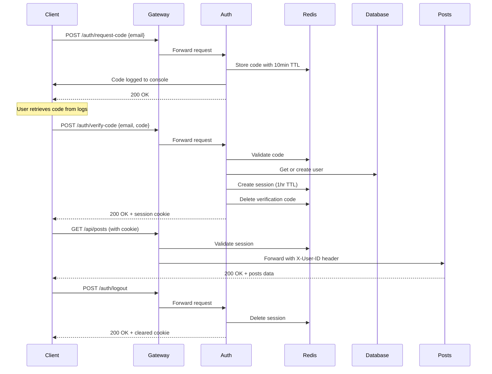

# Authentication API

Complete API reference for the authentication service endpoints. All auth endpoints are public (no authentication required) and are accessed via the API Gateway.

## Base URL

```
http://localhost:8080/auth
```

## Endpoints

- [POST /auth/request-code](#post-authrequest-code) - Request verification code
- [POST /auth/verify-code](#post-authverify-code) - Verify code and login
- [POST /auth/logout](#post-authlogout) - Logout and delete session
- [GET /auth/health](#get-authhealth) - Health check

---

## POST /auth/request-code

Generates a 6-digit verification code for passwordless authentication. The code is sent to the provided email address (currently logged to console in development mode).

### Request

**Headers:**
```http
Content-Type: application/json
```

**Body:**
```json
{
  "email": "user@example.com"
}
```

**Body Parameters:**
| Field | Type | Required | Description |
|-------|------|----------|-------------|
| email | string | Yes | Valid email address for authentication |

### Response

**Success (200 OK):**
```json
{
  "message": "Verification code sent to your email"
}
```

**Error (400 Bad Request):**
```json
{
  "error": "invalid request body"
}
```
*Returned when JSON is malformed or email is missing*

**Error (500 Internal Server Error):**
```json
{
  "error": "failed to generate verification code"
}
```
*Returned when code generation or Redis storage fails*

### Examples

**cURL:**
```bash
curl -X POST http://localhost:8080/auth/request-code \
  -H "Content-Type: application/json" \
  -d '{"email":"user@example.com"}'
```

**JavaScript (fetch):**
```javascript
const response = await fetch('http://localhost:8080/auth/request-code', {
  method: 'POST',
  headers: {
    'Content-Type': 'application/json',
  },
  body: JSON.stringify({
    email: 'user@example.com',
  }),
});

const data = await response.json();
console.log(data.message);
```

**Go:**
```go
body := bytes.NewBuffer([]byte(`{"email":"user@example.com"}`))
resp, err := http.Post(
    "http://localhost:8080/auth/request-code",
    "application/json",
    body,
)
```

### Development Mode

In development, verification codes are logged to the auth service console:
```
[DEV] Verification code for user@example.com: 123456
```

To view codes:
```bash
docker-compose logs -f auth-service | grep "Verification code"
```

### Notes

- Verification codes expire after 10 minutes
- Codes are 6 digits (000000-999999)
- Each code request invalidates previous codes for that email
- Rate limiting is not yet implemented (TODO)

---

## POST /auth/verify-code

Validates the verification code and creates an authenticated session. On success, returns a session cookie that must be included in subsequent requests to protected endpoints.

### Request

**Headers:**
```http
Content-Type: application/json
```

**Body:**
```json
{
  "email": "user@example.com",
  "code": "123456"
}
```

**Body Parameters:**
| Field | Type | Required | Description |
|-------|------|----------|-------------|
| email | string | Yes | Email address that received the code |
| code | string | Yes | 6-digit verification code |

### Response

**Success (200 OK):**
```json
{
  "message": "Login successful",
  "user": {
    "id": "550e8400-e29b-41d4-a716-446655440000",
    "email": "user@example.com",
    "username": "johndoe",
    "created_at": "2025-01-15T10:00:00Z",
    "updated_at": "2025-01-15T10:00:00Z"
  }
}
```

**Headers (Response):**
```http
Set-Cookie: session_id=550e8400-e29b-41d4-a716-446655440000; Path=/; Max-Age=3600; HttpOnly
```

**Error (400 Bad Request):**
```json
{
  "error": "invalid request body"
}
```

**Error (401 Unauthorized):**
```json
{
  "error": "invalid or expired verification code"
}
```
*Returned when the code is incorrect, expired, or already used*

**Error (500 Internal Server Error):**
```json
{
  "error": "authentication failed"
}
```
*Returned when database or session creation fails*

### Examples

**cURL:**
```bash
# Verify code and save cookies
curl -X POST http://localhost:8080/auth/verify-code \
  -H "Content-Type: application/json" \
  -d '{"email":"user@example.com","code":"123456"}' \
  -c cookies.txt

# Use session cookie for protected request
curl http://localhost:8080/api/posts \
  -b cookies.txt
```

**JavaScript (fetch):**
```javascript
const response = await fetch('http://localhost:8080/auth/verify-code', {
  method: 'POST',
  headers: {
    'Content-Type': 'application/json',
  },
  credentials: 'include', // Important: save cookies
  body: JSON.stringify({
    email: 'user@example.com',
    code: '123456',
  }),
});

const data = await response.json();
console.log('Logged in as:', data.user.email);

// Cookies are automatically included in subsequent requests
const postsResponse = await fetch('http://localhost:8080/api/posts', {
  credentials: 'include',
});
```

**Go:**
```go
// Verify code
body := bytes.NewBuffer([]byte(`{"email":"user@example.com","code":"123456"}`))
resp, err := http.Post(
    "http://localhost:8080/auth/verify-code",
    "application/json",
    body,
)

// Extract session cookie
cookies := resp.Cookies()
var sessionCookie *http.Cookie
for _, c := range cookies {
    if c.Name == "session_id" {
        sessionCookie = c
        break
    }
}

// Use session in subsequent requests
req, _ := http.NewRequest("GET", "http://localhost:8080/api/posts", nil)
req.AddCookie(sessionCookie)
client := &http.Client{}
resp, _ = client.Do(req)
```

### Session Details

**Cookie Attributes:**
- **Name**: `session_id`
- **Max-Age**: 3600 seconds (1 hour, configurable)
- **Path**: `/`
- **HttpOnly**: `true` (JavaScript cannot access)
- **Secure**: `false` in development, `true` in production
- **SameSite**: Not set (defaults to Lax in modern browsers)

**Session Expiration:**
Sessions expire after 1 hour (configurable via `SESSION_MAX_AGE` environment variable). After expiration, users must re-authenticate.

### Notes

- First-time users are automatically created in the database
- Returning users are fetched from the database
- Verification code is deleted after successful verification (single-use)
- Session is stored in Redis with automatic TTL expiration

---

## POST /auth/logout

Invalidates the current session and deletes the session cookie. After logout, the session ID cannot be used for authenticated requests.

### Request

**Headers:**
```http
Cookie: session_id=550e8400-e29b-41d4-a716-446655440000
```

**Body:** None

### Response

**Success (200 OK):**
```json
{
  "message": "Logout successful"
}
```

**Headers (Response):**
```http
Set-Cookie: session_id=; Path=/; Max-Age=0; HttpOnly
```
*Cookie is deleted by setting Max-Age to 0*

**Error (401 Unauthorized):**
```json
{
  "error": "unauthorized"
}
```
*Returned when no session cookie is provided or session is invalid*

### Examples

**cURL:**
```bash
# Logout using saved cookies
curl -X POST http://localhost:8080/auth/logout \
  -b cookies.txt \
  -c cookies.txt

# Verify session is deleted
curl http://localhost:8080/api/posts \
  -b cookies.txt
# Should return 401 Unauthorized
```

**JavaScript (fetch):**
```javascript
const response = await fetch('http://localhost:8080/auth/logout', {
  method: 'POST',
  credentials: 'include',
});

const data = await response.json();
console.log(data.message); // "Logout successful"

// Subsequent requests will be unauthorized
```

**Go:**
```go
req, _ := http.NewRequest("POST", "http://localhost:8080/auth/logout", nil)
req.AddCookie(sessionCookie)

client := &http.Client{}
resp, _ := client.Do(req)
```

### Notes

- Session is immediately deleted from Redis
- Cookie is cleared from client browser
- Logout is idempotent (calling multiple times has the same effect)

---

## GET /auth/health

Health check endpoint for monitoring and load balancing. Returns service status and can be used by Consul for health checks.

### Request

**Headers:** None

**Body:** None

### Response

**Success (200 OK):**
```json
{
  "status": "healthy",
  "service": "auth-service"
}
```

### Examples

**cURL:**
```bash
curl http://localhost:8080/auth/health
```

**Monitoring Script:**
```bash
#!/bin/bash
while true; do
  STATUS=$(curl -s http://localhost:8080/auth/health | jq -r '.status')
  if [ "$STATUS" != "healthy" ]; then
    echo "Auth service unhealthy!" | mail -s "Alert" admin@example.com
  fi
  sleep 30
done
```

---

## Error Codes

| Status Code | Meaning | Common Causes |
|-------------|---------|---------------|
| 200 | Success | Request completed successfully |
| 400 | Bad Request | Invalid JSON, missing fields, malformed data |
| 401 | Unauthorized | Invalid code, expired code, invalid session |
| 500 | Internal Server Error | Database error, Redis error, service failure |

---

## Complete Authentication Flow



---

## Rate Limiting (TODO)

Currently not implemented. Recommended implementation:

- **Code Requests**: 5 requests per email per hour
- **Verification Attempts**: 5 attempts per code
- **Account Lockout**: Lock after 10 failed verifications in 1 hour

---

## Testing

### End-to-End Test Script

```bash
#!/bin/bash

# 1. Request code
echo "1. Requesting verification code..."
curl -X POST http://localhost:8080/auth/request-code \
  -H "Content-Type: application/json" \
  -d '{"email":"test@example.com"}' \
  | jq

# 2. Get code from logs
echo "2. Check logs for code:"
docker-compose logs auth-service | grep "Verification code" | tail -1

# 3. Verify code (replace 123456 with actual code)
read -p "Enter verification code: " CODE
echo "3. Verifying code..."
curl -X POST http://localhost:8080/auth/verify-code \
  -H "Content-Type: application/json" \
  -d "{\"email\":\"test@example.com\",\"code\":\"$CODE\"}" \
  -c cookies.txt \
  | jq

# 4. Test protected endpoint
echo "4. Testing protected endpoint..."
curl http://localhost:8080/api/posts \
  -b cookies.txt \
  | jq

# 5. Logout
echo "5. Logging out..."
curl -X POST http://localhost:8080/auth/logout \
  -b cookies.txt \
  -c cookies.txt \
  | jq

# 6. Verify logout
echo "6. Verifying logout..."
curl http://localhost:8080/api/posts \
  -b cookies.txt \
  | jq
```

### Integration Tests

See [Testing Guide](../guides/testing.md) for comprehensive test examples.

---

## Production Considerations

### Email Delivery

Replace console logging with SMTP integration:

```go
// internal/email/sender.go
type EmailSender interface {
    SendVerificationCode(email, code string) error
}

// Use in auth service
err := emailSender.SendVerificationCode(email, code)
```

### Security Headers

Enable in production:
- Set `Secure` flag on cookies (HTTPS only)
- Add `SameSite=Strict` for CSRF protection
- Implement rate limiting
- Add CAPTCHA for automated attack prevention

### Monitoring

Recommended metrics:
- Code request rate (per email, per IP)
- Verification success/failure rate
- Session creation rate
- Average session lifetime

---

## Related Documentation

- [Session Package](../packages/session.md) - Session management implementation
- [Auth Package](../packages/auth.md) - Authentication service implementation
- [Getting Started](../guides/getting-started.md) - Development setup
- [Testing Guide](../guides/testing.md) - Test examples
